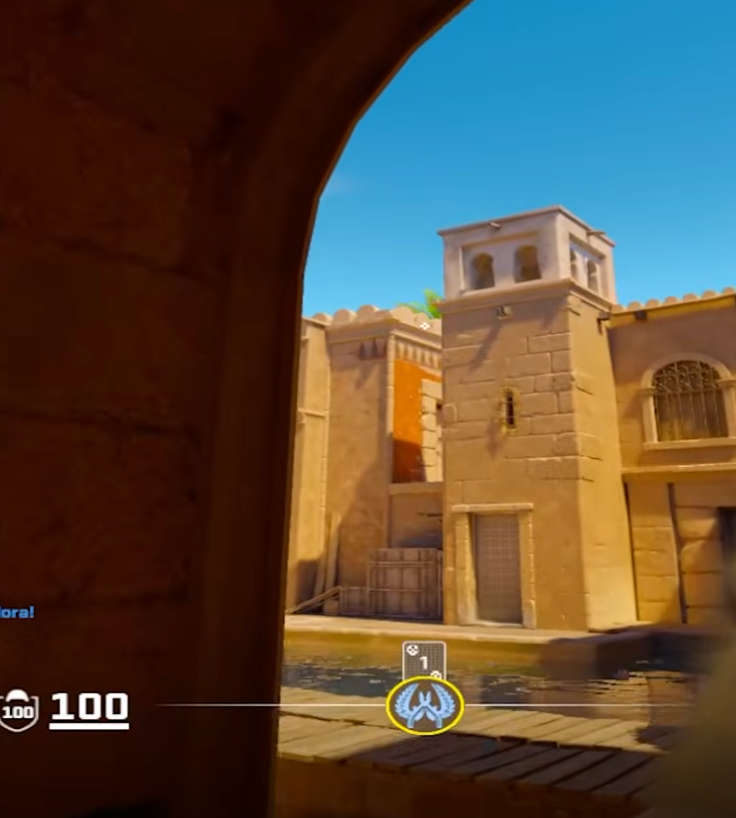

# Dominio Agua desde Medio   
 --- 
# Objetivo   
Con este protocolo podemos ganar un chokepoint importante del mapa, achicando el mapa, frenando a los terros y cerrando todas las rotaciones. Fondo esta cerrado por el/los de B, Medio por el jugador de ahi y Cuartito/Oscuro y Mercado por nosotros.   
# Requisitos   
- 1 humo   
- 1 molly   
- 1 flash   
- 1 o 2 jugadores   
   
Anubis se suele jugar con uno solo en A, que en este protocolo es uno de los que gana Agua desde Medio.   
En este protocolo, nadie va A porque, si sale bien, ya vamos a controlar la unica entrada al site ademas de Medio.   
# Pasos   
*Desde el punto de vista de quien debe hacer el primer contacto*   
## 1. Un compañero smokea escaleras   
Se puede hacer desde spawn con este lineup: [Smoke escaleras](smoke-escaleras.md)    
## 2. Flasheamos escaleras desde medio   
Tiramos flash escaleras con este lineup: [Flash escaleras](flash-escaleras.md)    
## 3. Apliamos el control con una molly en varanda   
    
